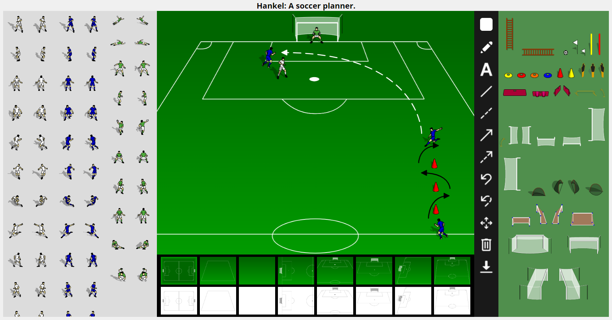

# Hankel
**A soccer planner.**  
This website is a simple soccer training and tactics planner created at the request of Mr. Hankel, a soccer coach. It includes many player icons, various equipment, and a multitude of pitches, both in color and black and white. Different markup options include drawing, text, lines, arrows, and curved arrows— all available in custom colors. The site also features a notes section to add specific information about the training drill or tactic, which can be saved with the image.  

  